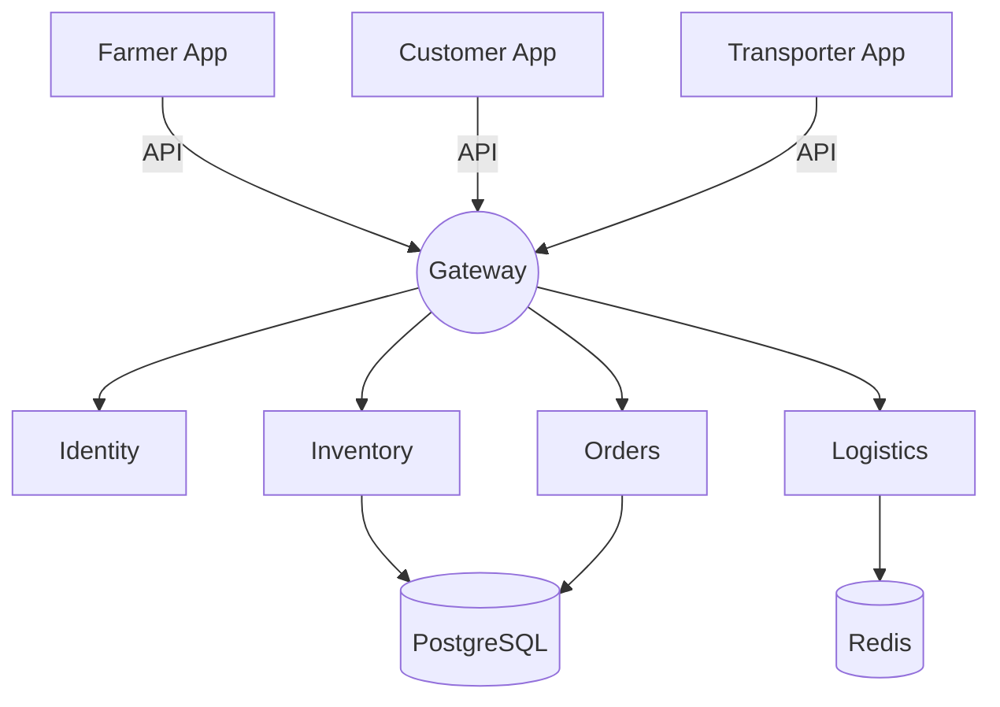
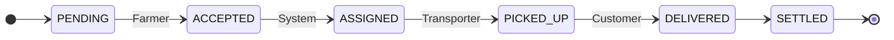

# FarmConnect (SIH26033)
## System Architecture & Technical Blueprint
**Date:** September 2026

---

## 1. Introduction

**Purpose:**
This technical blueprint defines the end-to-end agricultural supply chain system connecting farmers directly to consumers, retailers, and logistical partners.

**Scope (Multi-Platform Ecosystem):**
1. **Farmer Portal:** Crop listing and inventory management.
2. **Customer Marketplace:** Browsing and partial-quantity purchasing.
3. **Logistics & Transporter App:** Pickup, route optimization, and delivery.
4. **Collection Hub Dashboard:** Sorting and aggregating shipments.
5. **Admin Control Panel:** System intelligence and oversight.

---

## 2. System Architecture Design

**Approach:** Microservices / Modular Monolith

**Layered View:**
*   **Client Layer:** React/Next.js (Web) and React Native/Flutter (Mobile).
*   **API Gateway:** Centralized routing, authentication, and rate limiting.
*   **Business Logic:**
    *   Marketplace Service
    *   Order & Inventory Service
    *   Logistics & Routing Service
    *   User Identity Service
    *   Finance & Settlement Service
*   **Data Persistence:** PostgreSQL (Transactional), Redis (Cache/Locks), AWS S3 (Storage).

---

## 2.2 Conceptual Component Diagram

---

## 3. Core Workflows: Order State Machine

---

## 3.2 Inventory & Partial Locking

**Flexible Quantity Selection:**
*   When a customer adds `20 kg` of a `500 kg` listing to their cart, a temporary **Hold** is placed using a Redis distributed lock.
*   **Success:** If checkout completes within 10 minutes, the database safely decrements the main inventory.
*   **Timeout:** If checkout fails, the lock is released and inventory is freed.

---

## 4. Proposed Technology Stack

| Layer | Technologies |
| :--- | :--- |
| **Frontend** | React.js / Next.js (Web), TailwindCSS |
| **Backend** | Node.js (Express) / Python (FastAPI) |
| **Database** | PostgreSQL |
| **Cache/Locks** | Redis |
| **Auth** | JWT / Firebase Auth |
| **Maps/Routing** | Google Maps API / OSM |

---

## 5. Non-Functional Requirements (NFRs)

*   **Scalability:** Decoupled logistics and inventory for harvest seasons.
*   **Security:** Masking exact farm GPS coordinates (regional tags only).
*   **Performance:** < 500ms response time for marketplace searches.
*   **Availability:** 99.9% uptime target with automated backups.
*   **Localization:** Support for regional Indian languages (i18n).
